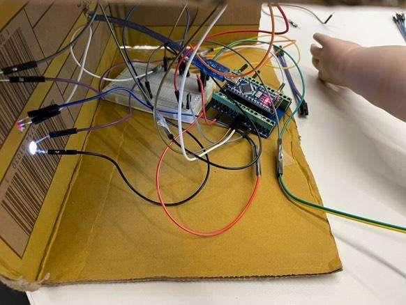
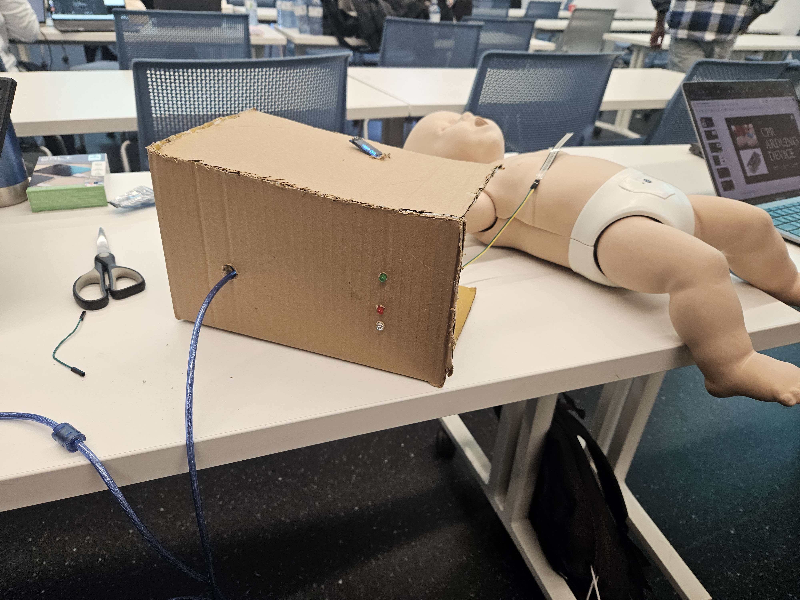
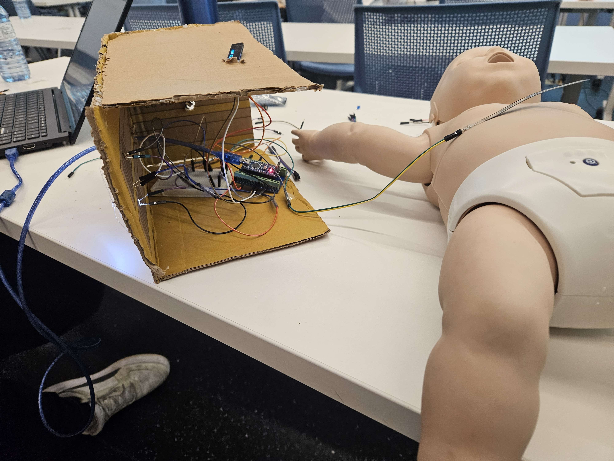
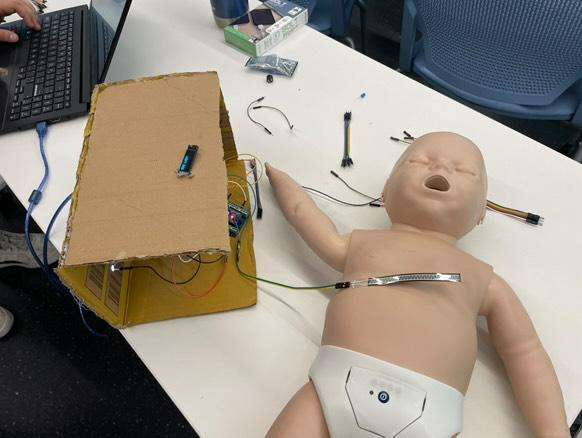
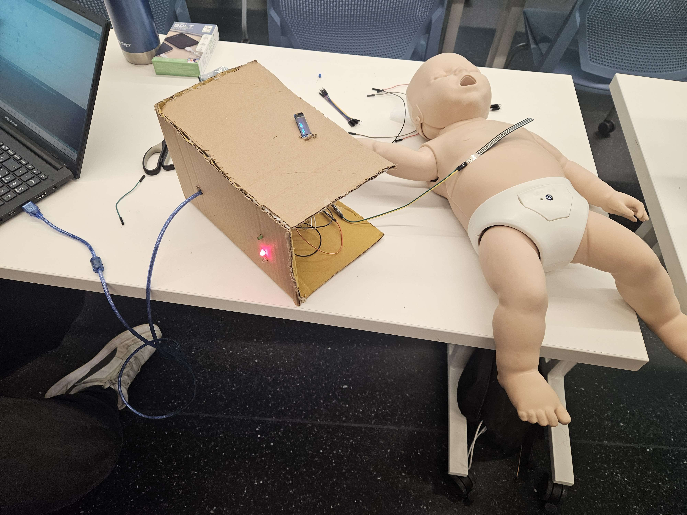

# Infant CPR Assistive Feedback System

## 🩺 Overview
The **Infant CPR Assistive Feedback System** was developed for the **BECU Arduino Competition**, hosted by the **Biomedical Engineering Course Union (BECU)** at **Toronto Metropolitan University**.

**Event Details**
- **Theme:** Design a healthcare-focused prototype using Arduino
- **Date:** November 16, 2024
- **Time:** 9:00 AM – 7:00 PM
- **Location:** DCC103, Toronto Metropolitan University
- **Team:** Sansar Sharma, Rican Williams, Suffian Ali, Krish Patel
- **Provided Components:** Arduino Mini, OLED display, pressure sensor, three LEDs, buzzer, jumper wires, breadboard, and basic enclosure materials

**What we built:**  
A real-time **CPR training aid for infants** that provides **pressure**, **heart rate rhythm**, and **timing** feedback from a pressure sensor wrapped around an infant mannequin, an **OLED display** for force feedback, **three LEDs** (green/red for rhythm sync; white for timing cue), and a **buzzer** for alerts.

---

## ⚙️ Features
- **Real-time pressure feedback** (too low / in range / too high) on an **OLED**.
- **Rhythm guidance** with **green** (in sync) and **red** (out of sync) LEDs.
- **Timing cue** via **white** LED for steady compression cadence.
- **Audible alert** using a **buzzer** for unsafe pressure.
- Built and demonstrated within a **single-day competition** using **Arduino IDE (C/C++)**.

---

## 🧩 Hardware Components
| Component | Purpose                                                    |
| --- |------------------------------------------------------------|
| Arduino Mini | Microcontroller for reading sensors and driving outputs    |
| Pressure Sensor | Measures CPR compression force                             |
| OLED Display | Visual feedback: pressure status (low / good / high)       |
| 3× LEDs (Green, Red, White) | Rhythm correctness + timing cue                            |
| Buzzer | Audible warning for unsafe pressure                        |
| Breadboard, Resistors, Wires | Allowing embedded code to connect to electrical components |
| Cardboard Enclosure | To cover the electrical wiring of the arduino system       |
| Infant Mannequin (provided) | Training surface for CPR demonstration                     |

---

## 💻 Software
- **IDE:** Arduino IDE
- **Language:** C/C++
- **Key Libraries:** `Wire.h`, `Adafruit_SSD1306.h`, `Adafruit_GFX.h`
- **Source File:** `BECU_Arduino_Competition_Code.ino`

> 💡 The full firmware is in this repository as `BECU_Arduino_Competition_Code.ino`.

---

## 📂 File Structure
├── images/  
│ ├── farTopView.jpg  
│ ├── insideView.jpg  
│ ├── otherSideView.jpg  
│ ├── sideView.jpg  
│ └── topView.jpg  
│  
├── video/  
│ └── demoVideo.mp4  
│  
├── BECU_Arduino_Competition_Code.ino  
└── README.md

---

## 🔌 Setup & Usage
1. **Open** `BECU_Arduino_Competition_Code.ino` in **Arduino IDE**.
2. **Select Board/Port** for your Arduino Mini (or compatible board).
3. **Install Libraries** (if missing):
   - Adafruit SSD1306
   - Adafruit GFX
4. **Upload** the sketch to the board.
5. **Place** the pressure sensor on/around the infant mannequin’s chest wrap/strap.
6. **Observe Feedback:**
   - **OLED** shows force status.
   - **Green/Red LEDs** reflect rhythm correctness.
   - **White LED** blinks for timing cadence.
   - **Buzzer** beeps if pressure is too high.

---

## 🖼️ Project Gallery
**Inside View**  

**Side View**  

**Other Side View**  

**Top View**  

**Far Top View (Full Setup with Infant Mannequin)**  

---

## 🎥 Demonstration Video

> Click above to watch the full demo on YouTube.

---

## 📌 Notes
- The mannequin used appears designed for medical training; our sensor was **strap-mounted** to read compression force.
- LED logic: **Green/Red** indicate **in/out-of-sync** with target rhythm; **White** provides **timing cue**.
- OLED reports **force status** for immediate corrective feedback.

---

## 🏫 Acknowledgments
Special thanks to the **Biomedical Engineering Course Union (BECU)** at **Toronto Metropolitan University** for organizing this competition and providing components and mentorship.
